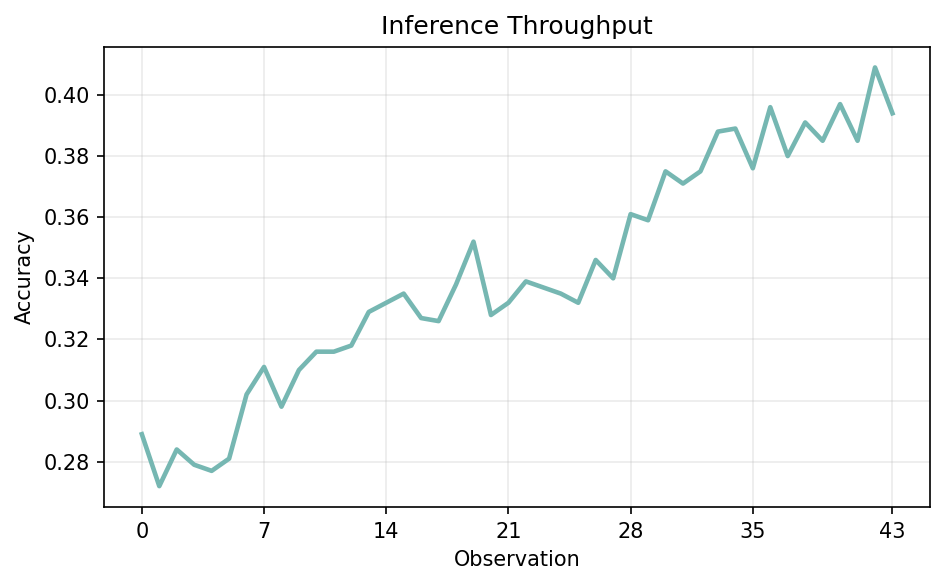
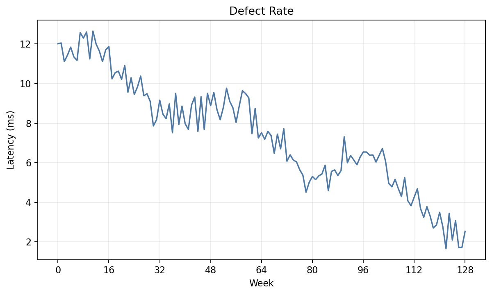
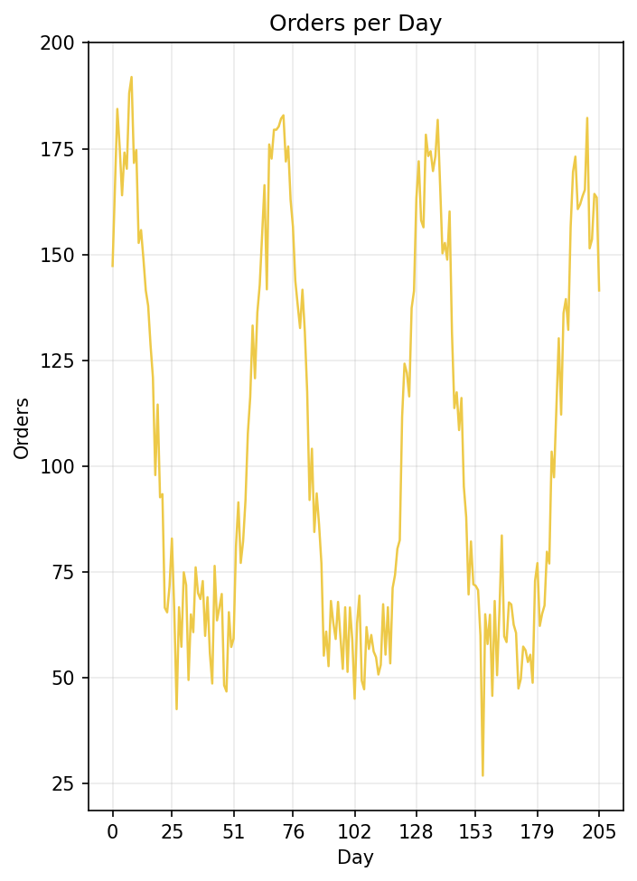
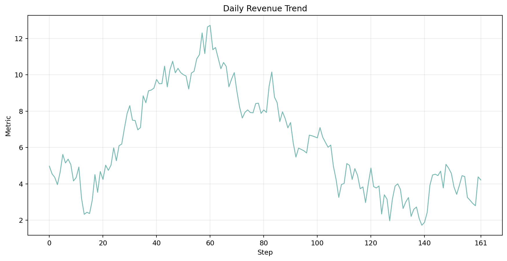
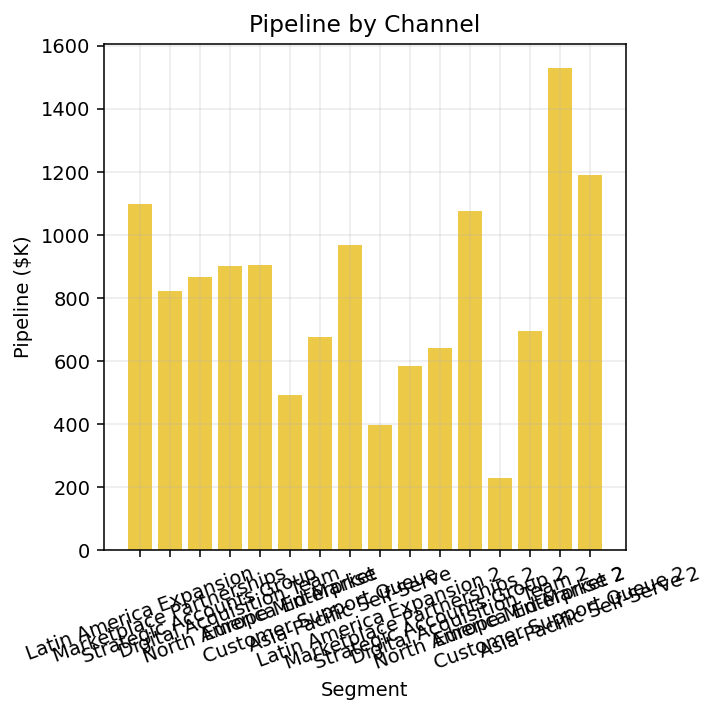
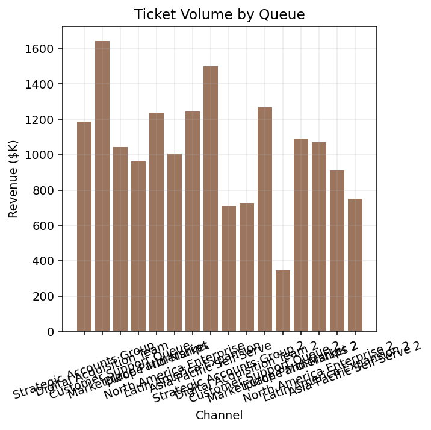

# Chart Extraction Summary

As of March 12, 2026, this repo has two distinct chart-extraction attempts:

1. an initial narrow synthetic dataset that Qwen3-VL-8B nearly solved without RL
2. a second dense/noisy dataset intended to look more like ML curves and business plots, which leaves real headroom for RL

## Latest Status

| Item | Status |
| --- | --- |
| Current dataset for the harder attempt | [`13point5/chart-extraction-dense-noisy-v1`](https://huggingface.co/datasets/13point5/chart-extraction-dense-noisy-v1) |
| Original easier dataset | [`13point5/chart-extraction-synth-v1`](https://huggingface.co/datasets/13point5/chart-extraction-synth-v1) |
| Current Prime environment | `13point5/chart-extraction@0.1.1` |
| Current env integration action | `SUCCESS` for job `dklpdqup1i8mxwg8gyk93488` |
| Current hosted RL runs | JSON `jp2xfslsy7io92dz6idgozst`, Markdown `nmnb0uqwu2gl1trjhj2r9nb6` |
| Current hosted RL status | both `RUNNING` on `Qwen/Qwen3-VL-8B-Instruct` |

## Attempt 2: Dense/Noisy Dataset

### Why A Second Attempt Was Needed

The initial dataset topped out at 12 points on the x-axis, which made the task too easy. The second pass kept the same typed generator approach but changed the data distribution to emphasize:

- dense noisy line charts with up to 500 points
- more realistic ML-style and business-style trends
- larger outputs that force the model to recover many more points
- a baseline that is clearly below saturation before RL starts

### Dataset Links

| Item | Value |
| --- | --- |
| Hugging Face dataset | [`13point5/chart-extraction-dense-noisy-v1`](https://huggingface.co/datasets/13point5/chart-extraction-dense-noisy-v1) |
| Local generation path | `environments/chart_extraction/outputs/chart_extraction/dense_noisy_local_v1` |
| Row schema | `id`, `image`, `answer`, `info` |
| Split sizes | `train=3000`, `validation=1000`, `test=1000` |
| Current RL slice | line-only via `chart_type_filter="line"` in the environment |

### Implemented Mix

| Axis | Current dense/noisy values | Notes |
| --- | --- | --- |
| `chart_type` | `line`, `bar` | Current hosted RL restricts to `line` only |
| Line share | `70%` | `2100/3000` train, `700/1000` validation, `700/1000` test |
| Bar share | `30%` | Kept in the pushed dataset, but excluded from current RL |
| Line point count | `32-499` | Validation `p50=179`, `p90=327`, `max=499` |
| Bar point count | `6-60` | Validation `p50=14`, `p90=18`, `max=58` |
| Data style | noisy trend, seasonal, random walk, business trend | Much closer to real ML and dashboard plots |
| Labels | short, medium, long | Long labels are part of the stress test |
| Image sizes | small/medium square, medium/large wide | Still sampled through typed profiles |

### Representative Dense Line Examples

These are examples from the harder dataset, copied from the local preview bundle.

| Example | Image |
| --- | --- |
| `train-00000`: short noisy line |  |
| `train-00001`: longer noisy line |  |
| `train-00003`: dense seasonal line |  |
| `validation-00002`: dense random-walk/business line |  |

### Bar-Chart Overlap Issue

The pushed dense/noisy dataset still contains bars, but the current RL and env path are line-only because some bar examples have overlapping x-axis labels and are not a good supervised target. That was handled by adding `chart_type_filter="line"` to the environment rather than republishing the dataset again.

Representative overlap cases from the dense dataset:

| Example | Image |
| --- | --- |
| `validation-00089`: long labels, medium-square canvas, 16 bars |  |
| `validation-00329`: long labels, medium-square canvas, 16 bars |  |

These are the concrete cases that motivated removing bars from the current RL slice.

### Baseline Results On The Dense Dataset

This baseline was run locally on the first `100` validation examples before any RL.

| Run ID | Model | Dataset scope | Mode | Completed rows | Avg reward | Point count | Point value | X type | Output tokens |
| --- | --- | --- | --- | ---: | ---: | ---: | ---: | ---: | ---: |
| `14cab8c5` | `qwen/qwen3-vl-8b-instruct` | local dense dataset | JSON | 99 | `0.5858` | `0.4382` | `0.3082` | `0.9697` | `806.8` |
| `c7fe28c4` | `qwen/qwen3-vl-8b-instruct` | local dense dataset | Markdown | 100 | `0.6786` | `0.5980` | `0.4377` | `1.0000` | `1011.9` |

Fair overlap on the shared `99` completed rows:

- JSON avg reward: `0.5858`
- Markdown avg reward: `0.6736`
- JSON point value score: `0.3082`
- Markdown point value score: `0.4288`

Interpretation:

- this dataset is genuinely harder than the first attempt
- there is clear RL headroom
- markdown was the better baseline target on the full dense local slice

### Line-Only Smoke Check Before RL

Before launching hosted RL, I ran a small smoke eval against the pushed dataset with the new line-only env filter.

| Mode | Model | Examples | Dataset source | Env args | Avg reward | Truncation |
| --- | --- | ---: | --- | --- | ---: | ---: |
| Markdown | `qwen/qwen3-vl-8b-instruct` | 5 | HF dense dataset | `chart_type_filter="line"` | `0.740` | `0.400` |
| JSON | `qwen/qwen3-vl-8b-instruct` | 5 | HF dense dataset | `chart_type_filter="line"` | `0.542` | `0.000` |

This is why `max_tokens` was left at `4096`. Markdown was already truncating on some dense line examples, so reducing the budget would have been counterproductive.

### Current Hosted RL Runs

These are the current 8B runs on the second attempt.

| Mode | Run ID | Model | Dataset | Env version | Status |
| --- | --- | --- | --- | --- | --- |
| JSON | `jp2xfslsy7io92dz6idgozst` | `Qwen/Qwen3-VL-8B-Instruct` | dense/noisy HF dataset, line-only slice | `0.1.1` | `RUNNING` |
| Markdown | `nmnb0uqwu2gl1trjhj2r9nb6` | `Qwen/Qwen3-VL-8B-Instruct` | dense/noisy HF dataset, line-only slice | `0.1.1` | `RUNNING` |

Shared config:

| Setting | Value |
| --- | --- |
| `max_steps` | `300` |
| `batch_size` | `128` |
| `rollouts_per_example` | `8` |
| `max_tokens` | `4096` |
| Validation interval | every `25` steps |
| Validation size | `100` examples |

### Main Takeaway From Attempt 2

This is the first version of the task that actually makes RL worthwhile. The dense line reconstruction problem is hard enough that the 8B baseline is clearly improvable, and the current hosted runs are targeting exactly that slice.

## Attempt 1: Initial Narrow Synthetic Dataset

### Why It Was Useful

The first attempt established the typed generator, the Hugging Face row format, the single-turn environment, the reward design, and the baseline/eval workflow. The problem was not that the code was bad; the problem was that the task was too easy.

### Dataset Links

| Item | Value |
| --- | --- |
| Hugging Face dataset | [`13point5/chart-extraction-synth-v1`](https://huggingface.co/datasets/13point5/chart-extraction-synth-v1) |
| Local generation path | `environments/chart_extraction/outputs/chart_extraction/dataset_v1_series1` |
| Split sizes | `train=2048`, `validation=256`, `test=256` |
| Chart types | single-series `line`, single-series `bar` |
| Point count | line `4-12`, bar `4-10` |

### Representative Initial Examples

| Example | Image |
| --- | --- |
| clean line chart |  |
| bar chart with longer category labels |  |

### Implemented Scope

| Axis | Values |
| --- | --- |
| `chart_type` | `line`, `bar` |
| `x_mode` | `numeric_even`, `categorical_ordered` |
| `data_profile` | `mono_up`, `mono_down`, `single_peak`, `single_valley`, `zigzag`, `flat`, `random_walk` |
| `label_profile` | `short`, `medium`, `long` |
| `style_profile` | `clean`, `grid`, `markers`, `grid_markers` |
| `annotation_profile` | `none`, `endpoint_labels` |
| `image_size_profile` | `small_square`, `medium_square`, `medium_wide`, `large_wide` |

### Baseline Results On The Initial Dataset

The final upstream baseline on the easier dataset was essentially saturated.

| Run ID | Model | Env source | Dataset source | Mode | Examples | Avg reward | Point value | Avg output tokens |
| --- | --- | --- | --- | --- | ---: | ---: | ---: | ---: |
| `539bc21e` | `qwen/qwen3-vl-8b-instruct` | pushed env | HF dataset | JSON | 8 | `0.9963` | `0.9926` | `142.8` |
| `2503bf4b` | `qwen/qwen3-vl-8b-instruct` | pushed env | HF dataset | Markdown | 8 | `0.9964` | `0.9928` | `84.8` |

This confirmed the main issue: the first dataset did not leave enough room for RL to be interesting.

### Hosted RL Results On Attempt 1

At the time of the first RL pass, hosted Prime RL did not expose the 8B VL model, so the completed runs used `Qwen/Qwen3-VL-4B-Instruct`.

| Mode | Run ID | Model | Status | Best train reward | Best val reward |
| --- | --- | --- | --- | ---: | ---: |
| JSON | `gqxe480i8tte8n0d7c01mfm9` | `Qwen/Qwen3-VL-4B-Instruct` | `COMPLETED` | `0.9952` | `0.9918` |
| Markdown | `wy876rtey6v27zbnf4eqmj0x` | `Qwen/Qwen3-VL-4B-Instruct` | `COMPLETED` | `0.9953` | `0.9888` |

Those runs completed cleanly, but they were optimizing a dataset that was already near ceiling.

### Main Takeaway From Attempt 1

Attempt 1 was the right systems pass. It built the generator, schema, environment, rewards, tests, baseline scripts, and RL plumbing. It was not the right research dataset because the point-count regime was too small.

## Shared Environment And Reward Design

| Item | Status |
| --- | --- |
| Prime environment slug | `13point5/chart-extraction` |
| Output modes | `json`, `markdown` |
| Reward style | weighted reward + zero-weight diagnostics |
| Tests | parsing, reward logic, dataset loading |

### Reward Components

| Metric | Type | Purpose |
| --- | --- | --- |
| `format_valid` | weighted | parse succeeds in the selected format |
| `chart_type_score` | weighted | exact chart type match |
| `series_name_score` | weighted | exact normalized series-name match |
| `point_count_score` | weighted | overlap in predicted vs target point count |
| `point_value_score` | weighted | x/y extraction quality |
| `x_type_score_metric` | zero-weight | diagnostic metric |
| `point_x_score_metric` | zero-weight | diagnostic metric |
| `point_y_score_metric` | zero-weight | diagnostic metric |
| `exact_answer_score_metric` | zero-weight | exact structured match |
| `normalized_y_mae_metric` | zero-weight | normalized y error |

## Main Files

| Topic | File |
| --- | --- |
| Dataset strategy | `DATASET_GENERATION_STRATEGY.md` |
| Summary logs | `logs/01-dataset-generator.md`, `logs/06-large-local-dataset.md`, `logs/08-line-only-8b-rl.md` |
| Dataset models | `environments/chart_extraction/chart_extraction_env/dataset/models.py` |
| Sampling logic | `environments/chart_extraction/chart_extraction_env/dataset/sampling.py` |
| Generator | `environments/chart_extraction/chart_extraction_env/dataset/generator.py` |
| HF packaging | `environments/chart_extraction/chart_extraction_env/dataset/hf.py` |
| Environment | `environments/chart_extraction/chart_extraction_env/environment.py` |
| Baseline runner | `scripts/chart_extraction/run_baselines.py` |

