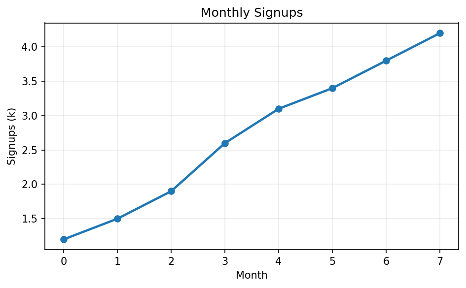
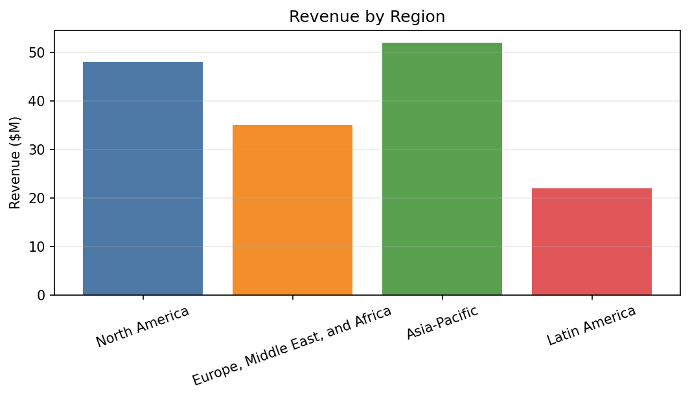
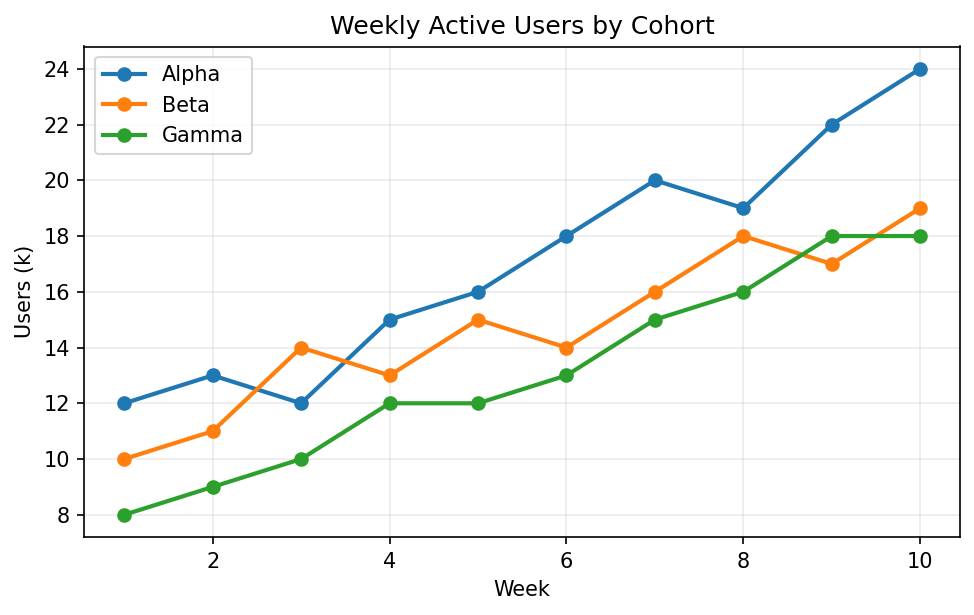
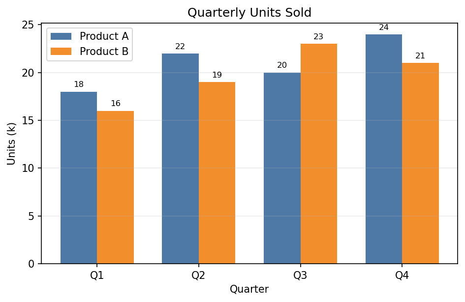

# Chart Extraction Dataset Generation Strategy

This document is the planning spec for the first synthetic dataset used by the `chart_extraction` environment. The goal is to keep the first generator small, deterministic, and easy to verify, while leaving a clean path to harder chart variants later.

## Goal

Train and evaluate a vision-language model to extract the data used to plot a chart when the chart image is the only input.

The first dataset should optimize for:

- exact ground truth from programmatic generation
- easy upload to Hugging Face
- deterministic rewards in Verifiers
- controlled diversity without a huge generator surface area

## Dataset Row Shape

We will publish a single Hugging Face dataset with one row per chart.

| Column | Type | Purpose |
| --- | --- | --- |
| `id` | `string` | Stable example identifier |
| `image` | `Image()` | Rendered chart image |
| `answer` | `string` | Canonical JSON string containing the extraction target |
| `info` | `string` | JSON string describing the latent generation choices and render settings |

### Example `answer`

```json
{
  "chart_type": "line",
  "x_type": "numeric",
  "series": [
    {
      "name": "series_1",
      "points": [[0, 1.2], [1, 1.5], [2, 1.1], [3, 1.9]]
    }
  ]
}
```

### Example `info`

```json
{
  "version": "v1",
  "chart_type": "line",
  "data_profile": "single_peak",
  "x_mode": "numeric_even",
  "label_profile": "short",
  "style_profile": "grid_markers",
  "annotation_profile": "none",
  "layout_profile": "wide",
  "image_size_profile": "medium_wide",
  "y_scale_profile": "medium_range",
  "figure_size_inches": [6.4, 4.0],
  "dpi": 150,
  "seed": 1234
}
```

## Design Principles

| Principle | Why it matters |
| --- | --- |
| Keep the target minimal | The model should learn chart extraction, not reproduce every plotting kwarg |
| Sample latent factors, then derive details | Easier to reason about diversity and hold out styles later |
| Use bucketed coverage, not pure random sampling | Prevents rare but important cases from being under-sampled |
| Separate near-term and long-term chart families | Lets us get a working environment before adding noisy edge cases |
| Validate generated images before keeping them | Avoid clipped labels, unreadable text, and degenerate plots |

## Near-Term Scope

The near-term plan is intentionally conservative. We want a dataset that is broad enough to support RL, but small enough that reward failures are interpretable.

### Phase Roadmap

| Phase | Chart types | Series count | Main purpose | Notes |
| --- | --- | --- | --- | --- |
| Phase 0 | Single-series line, single-series vertical bar | 1 | Smoke test the full pipeline | First generator and first Verifiers reward |
| Phase 1 | Add single-series scatter | 1 | Test point extraction without line continuity | Useful for point localization |
| Phase 2 | Add multi-series line, grouped bar | 2-4 | Introduce legend use and multiple series names | First real jump in task difficulty |

### Immediate v1 Recommendation

The first published dataset version should include only these chart types:

| Chart type | Include now | Why |
| --- | --- | --- |
| Single-series line | Yes | Best first chart for ordered point extraction |
| Single-series vertical bar | Yes | Tests categorical labels and magnitude extraction |
| Single-series scatter | Not in the first cut | Good next addition after line/bar are stable |
| Multi-series line | Not in the first cut | Adds legend dependence and series matching |
| Grouped bar | Not in the first cut | Adds multi-series grouping and layout complexity |

### Near-Term Dataset Size

| Split | Suggested size | Notes |
| --- | --- | --- |
| `train` | 2,000-5,000 | Enough to test training signal without overbuilding |
| `validation` | 200-500 | Similar distribution to train |
| `test` | 500 | Include some mild style shift |

## Long-Term Scope

These chart families are useful, but should wait until the near-term environment is stable.

| Chart type or variant | Why it is valuable | Why it is deferred |
| --- | --- | --- |
| Dense multi-series line | Closer to real-world dashboard charts | Harder series matching, label crowding, overlap |
| Grouped bar with many categories | Important business-chart pattern | More legend and spacing complexity |
| Stacked bar | Requires reasoning about cumulative structure | More ambiguous extraction target |
| Area chart | Common in dashboards | Boundary extraction is less direct |
| Horizontal bar | Broadens layout generalization | Not needed for first reward loop |
| Scatter with multiple series | Good for legend and point grouping | Harder clustering and association |
| Charts with heavy annotations | Realistic OCR clutter | Too many confounds for the first pass |
| Log scale or unusual axes | Valuable for robustness | Unnecessary for early RL |
| Dual-axis charts | High practical value | Hard to define a clean first target |

## Diversity Strategy

The generator should vary a small set of latent factors. Everything else should be derived from those factors.

### Data Diversity

| Axis | Near-term settings | Long-term additions | Why it matters |
| --- | --- | --- | --- |
| `data_profile` | `mono_up`, `mono_down`, `single_peak`, `single_valley`, `zigzag`, `flat`, `random_walk` | `outlier_heavy`, `seasonal`, `piecewise`, `mixed_sign` | Prevents the model from assuming one chart shape |
| `y_scale_profile` | `near_flat`, `small_range`, `medium_range`, `large_range` | `extreme_outlier`, `negative_values`, `log_scale_like` | Tests extraction when heights differ by very little or a lot |
| `x_mode` | numeric even spacing, categorical ordered | numeric irregular, categorical shuffled | Covers both axis-reading modes |
| point count | 4-12 | 13-40 | Early charts should stay readable |
| series count | 1 | 2-4 | Multi-series should be added only after single-series works |

### Text Diversity

| Axis | Near-term settings | Long-term additions | Why it matters |
| --- | --- | --- | --- |
| series names | short synthetic names, business-style labels | similar names, long natural names, abbreviations | Tests legend and output naming |
| x labels | short categories, short numeric ticks | long labels, rotated labels, dense labels | Adds OCR pressure carefully |
| title | off or short title | longer natural-language titles | Useful, but not needed in the first answer schema |
| axis labels | short labels only | longer units, abbreviations, punctuation | Helps later when label extraction is included |

### Visual Diversity

| Axis | Near-term settings | Long-term additions | Why it matters |
| --- | --- | --- | --- |
| color palette | a few fixed light-theme palettes | wider palettes, held-out palettes | Avoids renderer memorization |
| grid | on or off | stronger grid variation | Common visual style change |
| markers | on or off for line charts | marker every N points, more shapes | Affects point visibility |
| legend | off for single-series in v1 | on for multi-series, varied positions | Needed once multi-series is added |
| layout | square, wide, tall | more aspect ratios, denser margins | Tests resizing robustness |
| image dimensions | small, medium, large canvases at a few aspect ratios | broader canvas sizes and more held-out size combinations | Prevents overfitting to one rendered image size |
| font | a small safe set | held-out fonts in test | Useful for style generalization |
| DPI | a few values | broader resolution range | Adds mild rendering variation |

### Annotation Diversity

| Axis | Near-term settings | Long-term additions | Why it matters |
| --- | --- | --- | --- |
| point labels | mostly off | on for some charts | Adds clutter and OCR |
| bar value labels | off in training, rare in test | on more often later | Important but easy to defer |
| endpoint labels | rare | more common for multi-line charts | Realistic alternative to legends |
| callouts and arrows | none | some held-out eval slices | Too noisy for the first generator |

## Sampling Strategy

We should not sample every knob independently. Instead, sample a compact latent spec first, then derive concrete chart data and render kwargs.

### Proposed Near-Term Latent Spec

| Field | Example values |
| --- | --- |
| `chart_type` | `line`, `bar` |
| `data_profile` | `mono_up`, `single_peak`, `zigzag`, `flat` |
| `x_mode` | `numeric_even`, `categorical_ordered` |
| `label_profile` | `short`, `medium`, `long` |
| `style_profile` | `clean`, `grid`, `markers`, `grid_markers` |
| `annotation_profile` | `none`, `endpoint_labels` |
| `layout_profile` | `square`, `wide`, `tall` |
| `image_size_profile` | `small_square`, `medium_wide`, `large_tall` |
| `y_scale_profile` | `near_flat`, `small_range`, `medium_range`, `large_range` |

### Coverage Strategy

Use balanced buckets for the hard-to-hit cases instead of pure random generation.

| Axis | Suggested near-term coverage |
| --- | --- |
| `chart_type` | 50% line, 50% bar |
| `data_profile` | Roughly balanced across the selected profiles |
| `label_profile` | 30% short, 50% medium, 20% long |
| `style_profile` | Roughly balanced |
| `annotation_profile` | 85% none, 15% endpoint labels |
| `image_size_profile` | Bias toward medium sizes, but include some small and large canvases |
| `y_scale_profile` | Force explicit coverage of `near_flat` and `large_range` |

### Conditional Rules

These keep the generator simple without producing implausible charts.

| Rule | Reason |
| --- | --- |
| If `chart_type == "bar"`, use categorical `x_mode` only in v1 | Avoid mixing too many axes behaviors at once |
| If `label_profile == "long"`, prefer `wide` layout | Reduce clipped labels |
| If `image_size_profile` is small, cap label length and point count | Avoid unreadable charts that are hard for both training and eval |
| If `annotation_profile != "none"`, cap point count on line charts | Avoid unreadable overlaps |
| If `y_scale_profile == "near_flat"`, keep labels and styling otherwise clean | Isolate the intended difficulty |
| If `style_profile` includes markers, keep marker size within a narrow range | Helps extractability |

## Validation Rules

Every generated chart should pass a few simple checks before being included.

| Validation | Near-term expectation |
| --- | --- |
| No NaNs or inf values in source data | Required |
| No clipped title, ticks, or axis labels | Required |
| Minimum readable figure size | Required |
| Point count within allowed range | Required |
| Labels do not overlap excessively | Strong preference |
| Near-flat charts still have nonzero variation | Required |
| Bars are visually separable | Required |

## Example Families

These example images are not the final dataset. They are visual anchors for the initial chart families and diversity knobs.

| Example | File | What it demonstrates |
| --- | --- | --- |
| Clean single-series line | `docs/assets/chart_extraction/line_clean.png` | Base case for point extraction |
| Single-series bar with long labels | `docs/assets/chart_extraction/bar_long_labels.png` | Categorical labels and longer text |
| Multi-series line with legend | `docs/assets/chart_extraction/multiline_legend.png` | A near-term extension after v1 |
| Grouped bar with labels above bars | `docs/assets/chart_extraction/grouped_bar_labels.png` | A longer-horizon cluttered variant |

### Clean Single-Series Line



This is the easiest near-term chart family. It is a good fit for the first reward loop because the underlying points are ordered and visually separated.

### Single-Series Bar with Long Labels



This stays within the near-term scope but introduces one important difficulty axis: label length.

### Multi-Series Line with Legend



This should be added after the single-series setup is stable. It introduces series naming, legend usage, and multiple traces.

### Grouped Bar with Labels Above Bars



This is useful as a later target because it adds grouped structure, multiple series, and annotation clutter.

## Recommended Initial Dataset Mix

This is the smallest useful first version.

| Slice | Recommendation |
| --- | --- |
| chart types | single-series line and single-series vertical bar only |
| points per chart | 4-12 |
| titles | off or very short |
| legend | off |
| axis labels | short only |
| label lengths | mostly short and medium, some long |
| annotations | none |
| colors | a few fixed palettes |
| layouts | square and wide only |
| image dimensions | mostly medium canvases, with a small slice of smaller and larger renders |

## What to Leave Out of v1

These are good future additions, but they make the first generator and reward loop harder to debug.

- multi-series charts
- grouped and stacked variants
- heavy point or bar labels
- dense tick labels
- rotated long labels combined with clutter
- very high point counts
- dark themes
- log scales
- dual-axis charts

## Next Step After This Doc

Once this strategy is stable, the next implementation step should be a small Python package with:

1. Pydantic data models for the latent spec and canonical answer
2. A deterministic sampler for the near-term latent factors
3. A renderer that returns image bytes, `answer`, and `info`
4. A Hugging Face export path with `train`, `validation`, and `test` splits
