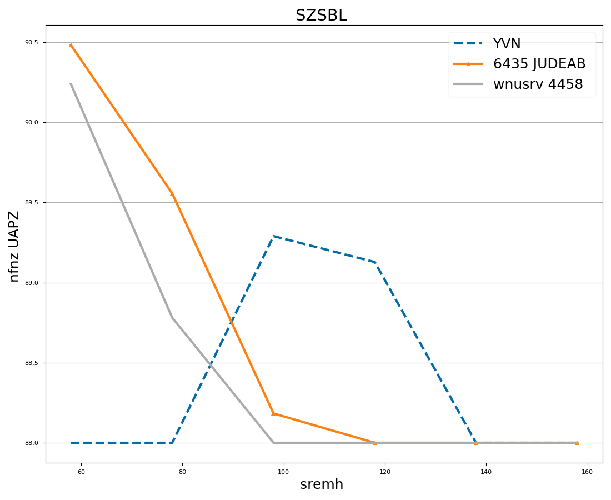
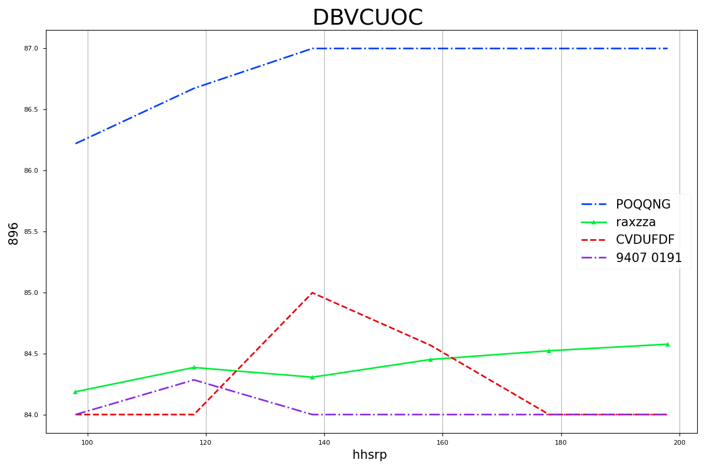
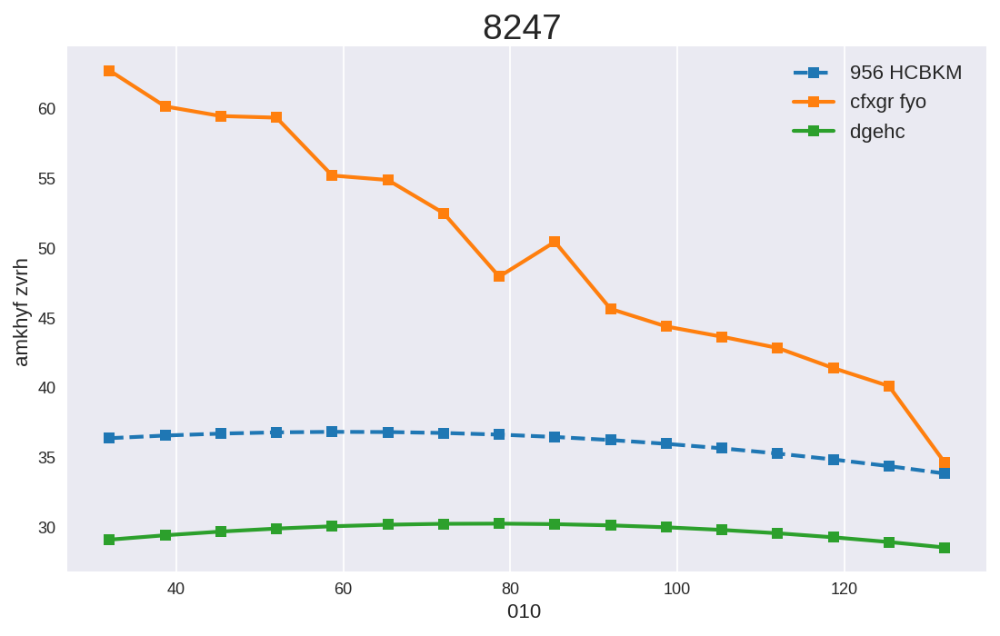
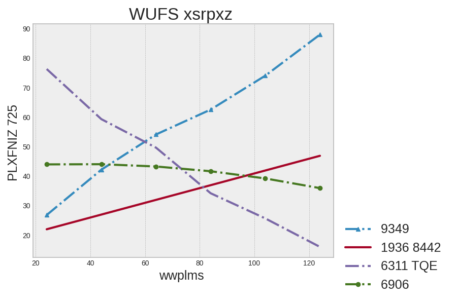
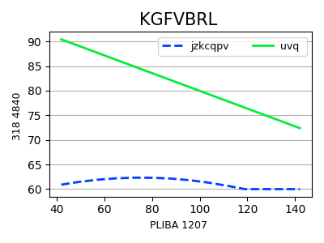

# `series_point_value` low-score analysis

Generated from eval run `/Users/13point5/projects/chart-extraction-env/environments/chart_extraction/outputs/evals/chart-extraction--qwen--qwen3-vl-8b-instruct/dc09fd55`.

## Run summary

- Model: `qwen/qwen3-vl-8b-instruct`
- Number of samples: `2000`
- Average total reward: `2.4501`
- Average `series_point_value`: `0.0197`

## Distribution snapshot

- `series_point_value = 0` on `1792 / 2000` samples (89.6%)
- `series_point_value < 0.05` on `1808 / 2000` samples (90.4%)
- `series_point_value < 0.1` on `1867 / 2000` samples (93.3%)
- Only `11` samples scored above `0.5` on this reward
- Among the zero-score cases, `1159` still had perfect `series_name_f1`
- `323` zero-score cases still had perfect names and `series_point_count_ratio >= 0.8`
- `116` zero-score cases still had perfect names and perfect point counts

## What the model seems to be doing

- In the strict subset where `series_point_value = 0`, `series_name_f1 = 1`, and `series_point_count_ratio = 1`, there are `116` samples.
- On those `116` samples, an order-aligned diagnostic y score averages `0.8989` with median `0.9399`.
- Their mean x offset is only `0.235` gold x-steps, with median `0.217`.
- `65` of those `116` strict zero-score cases have both `order_aligned_y_score >= 0.8` and `mean_x_step_ratio <= 0.25`.

Interpretation:

- A large share of the zero scores are not 'the model found the wrong series' failures.
- The common pattern is that the model recovers the right series names and roughly the right y trajectory, but snaps x values onto a nearby cleaner grid such as `60, 80, 100` instead of `58, 78, 98`.
- There are still genuine misses too, especially when a series name is typoed or a series is omitted, but the exact-x matching rule is masking a lot of near-miss behavior that would be useful signal during RL.

## Representative low-score examples

_Each example below comes from the saved 2,000-sample run and is paired with the original chart image from the Hugging Face test split._

## Example 1228: `1228.png`



- Title: `SZSBL`
- Axes: `x = sremh` and `y = nfnz UAPZ`
- Reward tuple: `reward=3.0000`, `series_name_f1=1.0000`, `series_point_count_ratio=1.0000`, `series_point_value=0.0000`
- Diagnostic tuple: `order_aligned_y_score=0.9943`, `mean_x_step_ratio=0.100`, `exact_x_match_fraction=0.0000`
- Read: This is the clearest 'same shape, wrong x grid' pattern. The model is tracking the series well, but it snaps x values onto a nearby cleaner grid.

Representative series `YVN`

Gold first 6 points:
```json
[[58.0, 88.0], [78.0, 88.0], [98.0, 89.2896499633789], [118.0, 89.12802124023438], [138.0, 88.0], [158.0, 88.0]]
```
Predicted first 6 points:
```json
[[60, 88.0], [80, 88.0], [100, 89.3], [120, 89.1], [140, 88.0], [160, 88.0]]
```

Representative series `6435 JUDEAB`

Gold first 6 points:
```json
[[58.0, 90.4819564819336], [78.0, 89.55591583251953], [98.0, 88.1830825805664], [118.0, 88.0], [138.0, 88.0], [158.0, 88.0]]
```
Predicted first 6 points:
```json
[[60, 90.5], [80, 89.5], [100, 88.2], [120, 88.0], [140, 88.0], [160, 88.0]]
```

Why the reward collapses to zero here: the implementation only scores a point when the predicted `x` exactly equals a gold `x`. In this example there are effectively no exact `x` matches across the matched series, so every point contributes zero credit.

## Example 255: `255.png`



- Title: `DBVCUOC`
- Axes: `x = hhsrp` and `y = 896`
- Reward tuple: `reward=3.0000`, `series_name_f1=1.0000`, `series_point_count_ratio=1.0000`, `series_point_value=0.0000`
- Diagnostic tuple: `order_aligned_y_score=0.9892`, `mean_x_step_ratio=0.100`, `exact_x_match_fraction=0.0000`
- Read: This is the clearest 'same shape, wrong x grid' pattern. The model is tracking the series well, but it snaps x values onto a nearby cleaner grid.

Representative series `POQQNG`

Gold first 6 points:
```json
[[98.0, 86.22008514404297], [118.0, 86.67316436767578], [138.0, 87.0], [158.0, 87.0], [178.0, 87.0], [198.0, 87.0]]
```
Predicted first 6 points:
```json
[[100, 86.2], [120, 86.7], [140, 87.0], [160, 87.0], [180, 87.0], [200, 87.0]]
```

Representative series `raxzza`

Gold first 6 points:
```json
[[98.0, 84.18701934814453], [118.0, 84.38587951660156], [138.0, 84.30645751953125], [158.0, 84.45162963867188], [178.0, 84.52303314208984], [198.0, 84.57648468017578]]
```
Predicted first 6 points:
```json
[[100, 84.2], [120, 84.4], [140, 84.3], [160, 84.5], [180, 84.5], [200, 84.6]]
```

Why the reward collapses to zero here: the implementation only scores a point when the predicted `x` exactly equals a gold `x`. In this example there are effectively no exact `x` matches across the matched series, so every point contributes zero credit.

## Example 101: `101.png`



- Title: `8247`
- Axes: `x = 010` and `y = amkhyf zvrh`
- Reward tuple: `reward=2.8889`, `series_name_f1=1.0000`, `series_point_count_ratio=0.8889`, `series_point_value=0.0000`
- Diagnostic tuple: `order_aligned_y_score=0.8483`, `mean_x_step_ratio=n/a`, `exact_x_match_fraction=0.0000`
- Read: The model still captures most of the chart structure, but the predicted x locations are quantized onto a coarser interval than the gold labels.

Representative series `956 HCBKM`

Gold first 6 points:
```json
[[32.0, 36.40400695800781], [38.66666793823242, 36.594486236572266], [45.33333206176758, 36.73370361328125], [52.0, 36.8216552734375], [58.66666793823242, 36.85833740234375], [65.33333587646484, 36.8437614440918]]
```
Predicted first 6 points:
```json
[[35, 36], [40, 36], [45, 36], [50, 36], [55, 36], [60, 36]]
```

Representative series `cfxgr fyo`

Gold first 6 points:
```json
[[32.0, 62.72029495239258], [38.66666793823242, 60.14984130859375], [45.33333206176758, 59.460960388183594], [52.0, 59.344417572021484], [58.66666793823242, 55.20357894897461], [65.33333587646484, 54.883358001708984]]
```
Predicted first 6 points:
```json
[[35, 62], [40, 60], [45, 59], [50, 55], [55, 55], [60, 54]]
```

Why the reward collapses to zero here: the implementation only scores a point when the predicted `x` exactly equals a gold `x`. In this example there are effectively no exact `x` matches across the matched series, so every point contributes zero credit.

## Example 1024: `1024.png`



- Title: `WUFS xsrpxz`
- Axes: `x = wwplms` and `y = PLXFNIZ 725`
- Reward tuple: `reward=3.0000`, `series_name_f1=1.0000`, `series_point_count_ratio=1.0000`, `series_point_value=0.0000`
- Diagnostic tuple: `order_aligned_y_score=0.9594`, `mean_x_step_ratio=0.192`, `exact_x_match_fraction=0.0000`
- Read: This is the clearest 'same shape, wrong x grid' pattern. The model is tracking the series well, but it snaps x values onto a nearby cleaner grid.

Representative series `9349`

Gold first 6 points:
```json
[[24.0, 26.806047439575195], [44.0, 42.18935775756836], [64.0, 54.12360382080078], [84.0, 62.5707893371582], [104.0, 74.06973266601562], [124.0, 88.0]]
```
Predicted first 6 points:
```json
[[25, 27], [50, 42], [60, 53], [80, 62], [100, 72], [120, 88]]
```

Representative series `1936 8442`

Gold first 6 points:
```json
[[24.0, 21.979917526245117], [44.0, 26.963184356689453], [64.0, 31.946449279785156], [84.0, 36.92971420288086], [104.0, 41.91297912597656], [124.0, 46.896244049072266]]
```
Predicted first 6 points:
```json
[[25, 22], [50, 30], [60, 36], [80, 40], [100, 42], [120, 48]]
```

Why the reward collapses to zero here: the implementation only scores a point when the predicted `x` exactly equals a gold `x`. In this example there are effectively no exact `x` matches across the matched series, so every point contributes zero credit.

## Example 1018: `1018.png`



- Title: `KGFVBRL`
- Axes: `x = PLIBA 1207` and `y = 318 4840`
- Reward tuple: `reward=1.7143`, `series_name_f1=0.5000`, `series_point_count_ratio=0.2143`, `series_point_value=0.0000`
- Diagnostic tuple: `order_aligned_y_score=0.1594`, `mean_x_step_ratio=n/a`, `exact_x_match_fraction=0.0000`
- Read: This looks like a genuine extraction miss: at least one series name was typoed or dropped, so the reward never even gets to compare those points.

Representative series `jzkcqpv`

Gold first 6 points:
```json
[[42.0, 60.90237808227539], [49.69230651855469, 61.4852180480957], [57.38461685180664, 61.91689682006836], [65.07691955566406, 62.197410583496094], [72.76923370361328, 62.32676696777344], [80.46154022216797, 62.30495834350586]]
```
Predicted first 6 points:
```json
[]
```

Representative series `uvq`

Gold first 6 points:
```json
[[42.0, 90.42278289794922], [49.69230651855469, 89.0350112915039], [57.38461685180664, 87.6472396850586], [65.07691955566406, 86.25947570800781], [72.76923370361328, 84.8717041015625], [80.46154022216797, 83.48393249511719]]
```
Predicted first 6 points:
```json
[[40, 90], [60, 87], [80, 84], [100, 81], [120, 78], [140, 74]]
```

Why the reward collapses to zero here: the implementation only scores a point when the predicted `x` exactly equals a gold `x`. In this example there are effectively no exact `x` matches across the matched series, so every point contributes zero credit.

## Initial takeaway

- The current reward is excellent at detecting exact coordinate agreement, but it is harsh as a learning signal because a small x shift erases otherwise useful partial credit.
- Before changing the reward, the model behavior to keep in mind is: names are often correct, counts are often close, y shapes are often close, and x values are frequently quantized or shifted onto a nearby regular grid.
- That makes a tolerance-aware or alignment-aware variant of `series_point_value` a promising next step.
